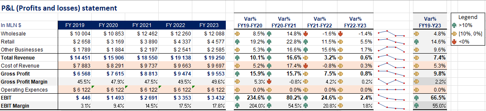
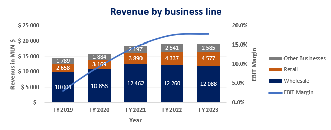
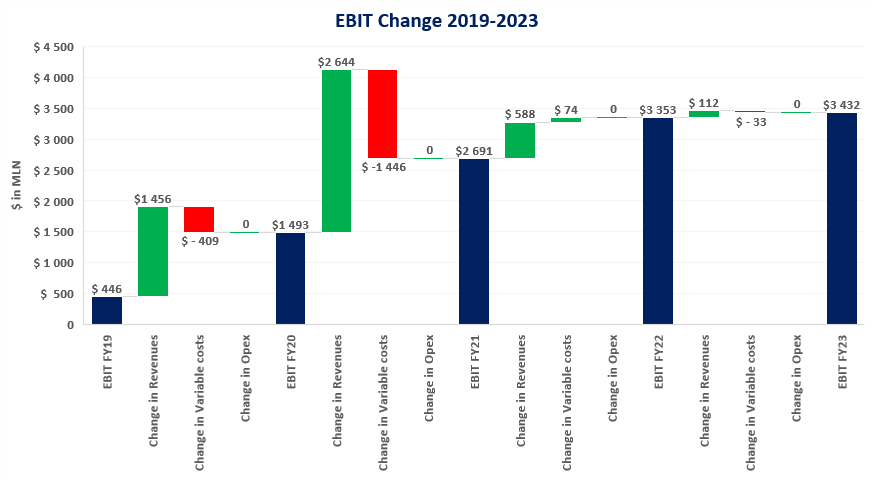

# Analysis and Visualization of Profit & Loss (P&L) Data in Excel

## Project Overview
This project focuses on organizing, analyzing, and visualizing financial data extracted from Bloomberg. The data includes detailed Profit & Loss (P&L) information of Adidas ("ADS GY Equity") from 2019 to 2023, segmented by products, brands, and regions. The goal was to transform the raw data into an actionable report for decision-making by preparing concise tables, applying professional formatting, and creating insightful visualizations.

## Objective
To create a professional, easy-to-understand summary of Adidas' financial performance, enabling management to quickly grasp revenue trends and profitability margins.

---

## Problem Statement
Data extracted from Bloomberg terminals is typically raw and unformatted, making it difficult for decision-makers to interpret directly. The challenge was to:

- Structure the raw data into a standard P&L format, up to the EBIT level.
- Perform advanced financial calculations like Gross Profit Margin, EBIT Margin, and Compound Annual Growth Rate (CAGR) for revenue.
- Visualize revenue growth and profitability trends in a manner that communicates insights effectively.

---

## Tasks Completed

1. **Data Structuring and Formatting**  
   - Prepared a professional P&L table with details up to the EBIT level.  
   - Renamed "Operating Income" to "EBIT" for clarity.  
   - Applied advanced Excel functions to organize and format the data effectively.

2. **Financial Analysis**  
   - Populated the P&L format with data extracted from Bloomberg.  
   - Calculated key financial metrics:  
     - **Gross Profit Margin**: Gross Profit / Revenue  
     - **EBIT Margin**: EBIT / Revenue  
     - **CAGR for Revenue**: Reflecting the revenue variation over the analyzed period.
    
     
   *Figure: Profit & Loss Table*

3. **Data Visualization**  
   - Designed charts to represent:  
     - Revenue growth trends over the years.  
     - Profitability comparisons using Gross Profit Margin and EBIT Margin.

     
   *Figure: Revenue by Business Line (2019-2023)*

     
   *Figure: EBIT Change*

4. **Performance Commentary**  
   - Compared Adidas' financial performance in 2019 and 2023, analyzing trends, margins, and growth.

---

## Insights and Conclusions

- During the period of 2019 to 2023, considering the total revenue, gross profit, and EBIT and seeing the variation of these values between those years, it is evident that the company managed to achieve excellent results, improving by 67% the EBIT, the total revenue by 7%, and the gross profit by 10%. It is important to mention that they achieved this EBIT while maintaining constant operating expenses in all the years.
- If we analyze the evolution year by year, we see that the company, in all years, managed to increase the revenue (with an increase of 7.75% on average). However, it is necessary to find new ways to improve the business revenue (or reduce costs) because in the last year (from 2022 to 2023), there were almost zero improvements (also zero drawbacks), signaling that the business may be stagnating.
- In the whole period of 2019-2023, the fastest/higher growth was made by the retail part of the business, while the wholesale segment showed the slowest/lower growth.
- By analyzing the overall results, we conclude that Adidas was able to increase profitability while increasing revenue (noting that profitability increased more than revenue).

The financial data from FY 2019 to FY 2023 reflects a robust performance for the company in growth and profitability. Revenue growth has been steady, with strength in the Retail segment. Profitability has not only been maintained but has also seen significant improvements across key metrics, including substantial growth in EBIT. This balance of top-line growth with bottom-line improvements indicates a well-managed expansion. Adidas demonstrated a robust competitive position in the industry and a sustainable growth trajectory. The combination of growth in both revenue and profitability metrics suggests strategic execution in market penetration and cost control.

---

## Key Learnings
This project demonstrated the importance of:

- **Advanced Excel Skills**: Lookup functions, professional formatting, and charting are essential for data transformation and presentation.  
- **Critical Financial Analysis**: Synthesizing raw data into meaningful insights is a core skill for analysts.  
- **Data Storytelling**: Visualizations and concise summaries can turn complex datasets into actionable reports.

---

## Technologies Used
- **Microsoft Excel**: Data organization, formatting, and analysis.